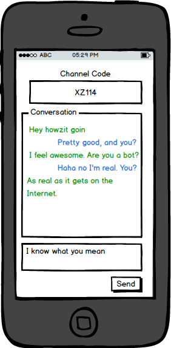

# Speakeasy for Android

Hey thanks for taking my programming challenge. Out of respect for your time, please work for 1-2 hours, but don't stress too hard. This is not a timed challenge. You can spend as little or as much time as you desire. I don’t expect you to finish this challenge (unless you really want to); it’s more to get a sense of your approach to programming. The people who get hired tend to show their *best* and *most elegant* work rather than their quickest or most feature-complete work.

## Objective

Write an Android App and socket server to exchange text messages with another Android App based on a shared "channel code".

## Instructions

* Fork and clone this repo. It contains an Android app skeleton.
* The app should take a channel code. You can assume <=2 people per channel.
* When you type something, it sends it via TCP socket to the channel.
* When something is broadcast on your channel code, you see the message appear in the chat history.

## Bonus points (in order of WOW factor)

* Create the socket server using PHP or nodejs
* Make the socket server queue messages and 'catch you up' if you connect late
* Allow >2 participants per chat
* Allow pictures
